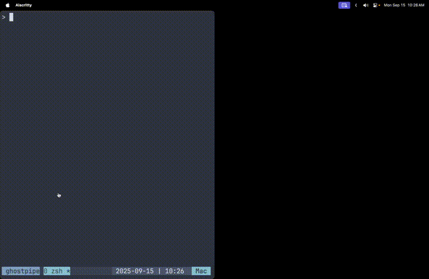
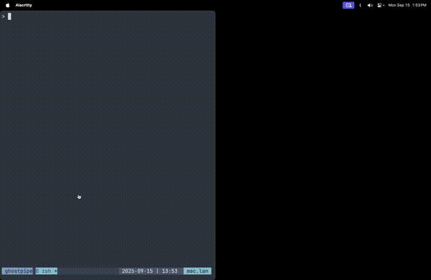

# Ghostpipe

Connect files in your codebase to user interfaces

- Apps can only see the files you explicitly share with them
- Your data lives in your codebase and under version control
- No account or installation needed to use a ghostpipe app
- Keep using the dev tools (editor, ai agent) you're used to

## Examples

#### Excalidraw



#### Swagger / OpenAPI


#### N8N (Proof of Concept)



#### Config File Support


#### Diff Mode


## Quickstart (Excalidraw demo)

```bash
npm install -g ghostpipe
```

```bash
ghostpipe https://excalidraw.ghostpipe.dev
```

Open the link and draw something.

## How it works

Ghostpipe uses yjs and webrtc to connect codebase files with applications. Chokidar is used to watch for file changes locally. Connected applications use `pipe` and `signaling` query params to connect to yjs over webrtc and read the file contents.

## Installation

```bash
npm install -g ghostpipe
```

## Usage

### Basic Usage

Connect a file to a web interface:

```bash
ghostpipe [url] [file]
```

Examples:
```bash
ghostpipe https://excalidraw.ghostpipe.dev              # Will prompt for file or create one
ghostpipe https://swagger.ghostpipe.dev api.yml         # Connect api.yml to Swagger interface
```

### Configuration-based Usage

Use interfaces defined in configuration file:

```bash
ghostpipe                     # Uses ghostpipe.config.json or ~/.config/ghostpipe/config.json
ghostpipe --verbose           # Enable verbose logging
```

### Diff Mode

Compare current working directory files with a git branch:

```bash
ghostpipe [url] [file] --diff              # Compare with 'main' branch (default)
ghostpipe [url] [file] --diff develop      # Compare with 'develop' branch
ghostpipe [url] [file] --diff feature-123  # Compare with 'feature-123' branch
```

When diff mode is enabled, the tool will:
- Share your current working directory files
- Also send the base version of each file from the specified git branch
- Allow interfaces to display diffs between the current version and the base branch version
- Only works in git repositories

### Configuration

Create a `ghostpipe.config.json` file in your project root or `~/.config/ghostpipe.json`:

```json
{
  "signalingServer": "wss://your-signaling.com",
  "interfaces": [
    {
      "name": "OpenAPI",
      "host": "https://swagger.ghostpipe.dev",
      "files": [".ghostpipe/openapi.yml"]
    },
    {
      "name": "ERD",
      "host": "https://erd.ghostpipe.dev",
      "files": [".ghostpipe/erd.yml"]
    }
  ]
}
```

### Options

- `--verbose`: Enable detailed logging
- `--diff [branch]`: Base branch for diff comparison (defaults to 'main' if no branch specified)
- `--version`: Show version information
- `--help`: Display help information

## Example Ghostpipe Applications

- [Excalidraw](https://github.com/inputlogic/ghostpipe-excalidraw)
- [Swagger](https://github.com/inputlogic/ghostpipe-swagger)

## Local development

- clone the repo
- `npm install`
- `npm link`
- now you should be able to run `ghostpipe` from any project

## License

MIT
